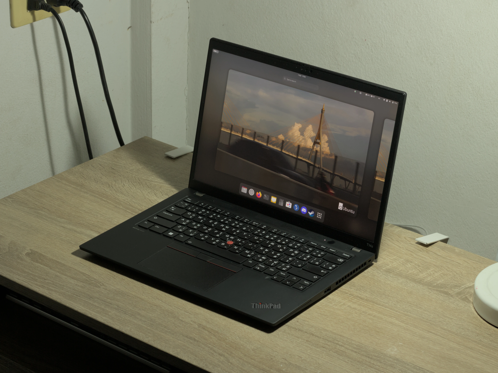

# Background wallpapers, taken by Senni.



All pictures presented in this repository is my own.

## Instructions

### For Linux systems running major desktop environments (GNOME, KDE, XFCE, etc)

Run ```make install``` after cloning the repository, and ```make uninstall``` to remove them.

### Other systems

Download the zip file in "Releases" tab, or browse the wallpapers in "backgrounds" folder to choose which pictures you would like to use. 

## Equipment Used
- Canon EOS 60D
- Canon EF 50mm f/1.8 STM
- Canon EF 75-300mm f/4-5.6
- Edited with Photos app for iPadOS, Darktable and RawTherapee for Linux

---

This wallpaper set is distributed under the **CC-BY-NC-SA 4.0 International License** (Creative Commons Attribution-NonCommercial-ShareAlike). 

You are free to download, modify, and share, but **any commercial use is strictly prohibited** unless you get explicit permission from me beforehand. If you remix, adapt, or share the work, you **must release it under this exact same license** and credit must always be given to me.
